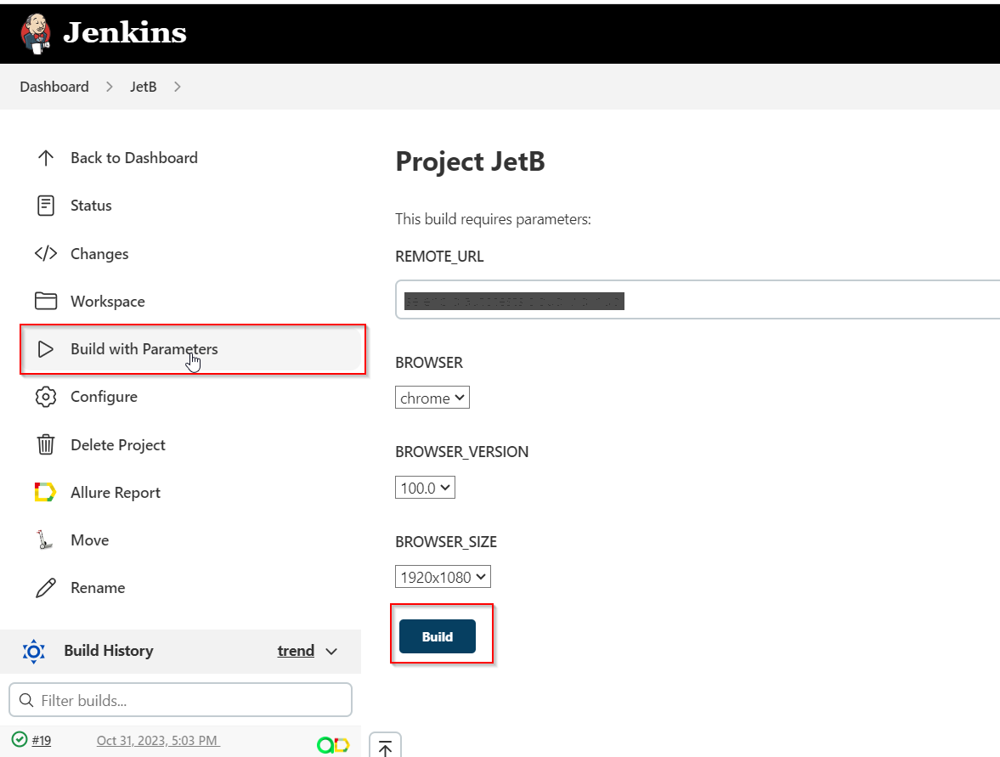

## UI automation tests https://jetbrains.com

##	Table of contents

- [Technologies and tools](#technologist-technologies-and-tools)
- [Implemented checks](#bookmark-tabs-implemented-checks)
- [Running tests from the terminal](#computer-running-tests-from-the-terminal)
- [Running tests in Jenkins](#-running-tests-in-jenkins)
- [Test results report in Allure Report](#-test-results-report-in-allure-report)
- [Integration with Allure TestOps](#-integration-with-allure-testops)
- [Integration with Jira](#-integration-with-jira)
- [Telegram notifications using a bot](#-telegram-notifications-using-a-bot)
- [Test running example in Selenoid](#-test-running-example-in-selenoid)

## Technologies and tools

<p  align="center">

<code></code>
<code></code>
<code></code>
<code></code>
<code></code>
<code></code>
<code></code>
<code></code>
<code></code>
<code></code>
<code></code>
<code></code>
</p>

## Implemented checks:


- ✓ Verify Website Can Be Opened
- ✓ Verify Redirection to Store Page from Cart Icon Click
- ✓ Verify Proper Functioning of Search - Short
- ✓ Verify Proper Functioning of Search -Extended
- ✓ Verify Page Language Change

## :computer: Running tests from the terminal
### Local running tests

```
gradle clean JetBrainsTest JetBrainsParamTest
```

### Remote running tests

```
gradle clean JetBrainsTest JetBrainsParamTest 
-Dbrowser=${BROWSER}
-DbrowserVersion=${BROWSER_VERSION} 
-DbrowserSize=${BROWSER_SIZE} 
-DremoteUrl=${REMOTE_URL}
```

> `${BROWSER}` - browser name (_default name - <code>chrome</code>_).
>
> `${BROWSER_VERSION}` - browser version (_default name - <code>100.0</code>_).
>
> `${BROWSER_SIZE}` - browser window size (_default name- <code>1920x1080</code>_).
>
> `${REMOTE_URL}` - remote server address where tests will be run.

##  Running tests in [Jenkins](https://jenkins.autotests.cloud/job/JetB/)
Click on the <code><strong>*Build with parameters*</strong></code> button and set options. Then click on the <code><strong>*Build*</strong></code> button to run the process.

<p align="center">
  
</p>

Once the build is finished, click on the <code><strong>*Allure report*</strong></code> icon in the <code><strong>*Builds history*</strong></code> to access the test execution report page. 
<p align="center">
  
</p>

##  Test results report in [Allure Report](https://jenkins.autotests.cloud/job/JetB/19/allure/)
<p align="center">
  
</p>

##  Integration with [Allure TestOps](https://allure.autotests.cloud/launch/31269)
## Main dashboard

<p align="center">
  
</p>

## Test results

<p align="center">
  
</p>

##  Integration with [Jira](https://jira.autotests.cloud/browse/HOMEWORK-926)

<p align="center">
  
</p>

##  Telegram notifications using a bot
As soon as the build is completed, a message with the test report is sent to the <code>Telegram</code> bot.

<p align="center">

</p>

##  Test running example in Selenoid

Each test in the report includes an attached video.

<p align="center">
  
</p>